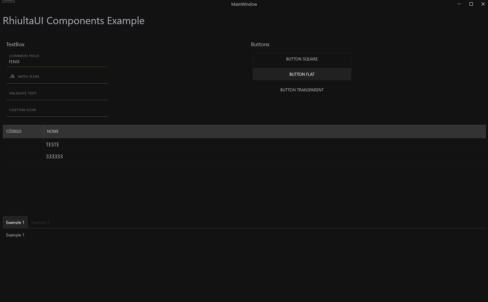

## Overview
RhiultaUI é simples framework que substitui o estilo padrão de todos os controles WPF comuns e dá a eles uma aparência moderna.

### Note
----
Este framework projeto foi desenvolvido para uso em soluções comerciais nas quais desenvolvi.
Caso sobre algum tempo, tentarei atualizar alguns componentes. :)

Have a good day!
